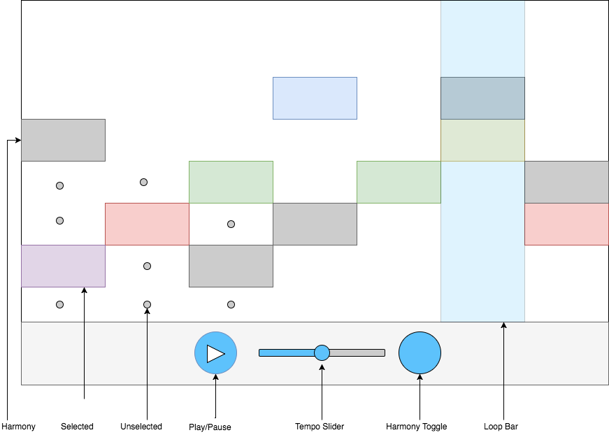

# tuneLoop

## MVP

tuneLoop is an interactive music app that lets users create melodies. It consists of an 8 by 14 grid of possible notes, which play in a regular loop if selected. The core of tuneLoop will consist of:

  * A grid of rectangles mapped to specific tones and corresponding colors.
  * The option to select and deselect notes.
  * A bar that consistently passes over the grid in time with each column sounding.
  * Play and pause functionality.

## Wireframe

## Architecture and Technologies

tuneLoop will be built on a foundation of JavaScript, Canvas with EaselJS for graphics, Tone.js for audio, and webpack to tie them all together.

Technical challenges will include my first usage of audio and Tone.js, as well as seamlessly handling the dynamic series of selected tones (and corresponding harmonies) as users change patterns during the continuous loop.

I will implement a click-handler on each note-space, which selects or deselects the space, deselects any other space in the same column, and maps the corresponding tone to a hash which tracks the sounding notes for each column.

## Implementation Timeline

Day 1: Focus on display
  * Construct grid
    * Make spaces responsive to screen width
    * Render dots for unselected spaces
    * Render rectangles for selected spaces
    * Give each row different color
    * Toggle colored rectangle on click
  * Render Loop Bar with consistent transition across screen

Day 2: Finish basic display, begin sound
  * Create Play Button, which starts and stops Loop Bar transition
  * Study Tone.js
  * Create audio for each tone
    * Get app to play audio
  * Construct hash map of selected/sounding tones
    * Expand on click functionality to adjust tone map
  * Sync audio play to Loop Bar

Day 3: Finish basic sound, begin polishing MVPs
  * App can play and pause synced audio and visual loop
    * Fade selected rectangle on hover
    * Change color of selected spaces when overlapping with Loop bar
  * Add harmony toggle
    * Generate auto-harmony through a two-column-span echo
      * render harmony as greyed/faded rectangle
        * BONUS transition slide in and out on toggle
      * add harmony to audio map, play tones simultaneously

Day 4: Polish and bonus
  * Address any incomplete features from Days 1-3
  * Add tempo slider
    * Create tempo variable based on slider position
    * Adjust Loop speed visual transition and note duration

## Bonus Features
  * Toggle harmony automatically derived from selected melody.
  * Tempo slider
  * Select multiple notes per column
  * Introduce semi-tones (spaces halfway between each note)
  * Change instruments
  * Demo/intro track
  * Save/share melodies
